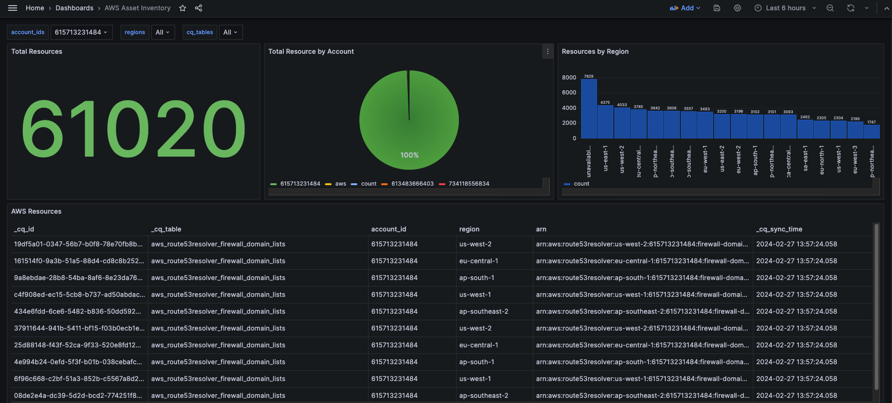

# CloudQuery AWS Asset Inventory Dashboard for Grafana

## Overview

This contains an AWS Asset Inventory Dashboard for Grafana on top of CloudQuery [AWS plugin](https://hub.cloudquery.io/plugins/source/cloudquery/aws) and [AWS Asset Inventory pack](https://hub.cloudquery.io/addons/transformation/cloudquery/aws-asset-inventory/).

## Requirements

- [CloudQuery](https://docs.cloudquery.io/docs/quickstart/)
  - [AWS Plugin](https://hub.cloudquery.io/plugins/source/cloudquery/aws)
  - [PostgreSQL Plugin](https://hub.cloudquery.io/plugins/destination/cloudquery/postgresql)
  - [AWS Asset Inventory Pack](https://hub.cloudquery.io/addons/transformation/cloudquery/aws-asset-inventory/)

### Setting up the dashboard

1. Follow the instructions to set up the [AWS Asset Inventory Transformation](https://hub.cloudquery.io/addons/transformation/cloudquery/aws-asset-inventory/).

2. In Grafana, make sure your PostgreSQL database is added as a data source.

3. Download this package (using the **Download now** button on top) and extract this package.

4. [Import](https://grafana.com/docs/grafana/latest/dashboards/build-dashboards/import-dashboards/) the `asset_inventory.json` dashboard definition from this package.

   - Note: If you have installed Postgres via Docker, ensure that Grafana is also installed via Docker. Once installed, you can use the IP address of your postgres container found by running `docker inspect container <container name>` along with the port as your host connection.

### Example dashboard

Once you have connected Grafana to your Postgres database and have imported the dashboard template, you should see a dashboard similar to this one:

